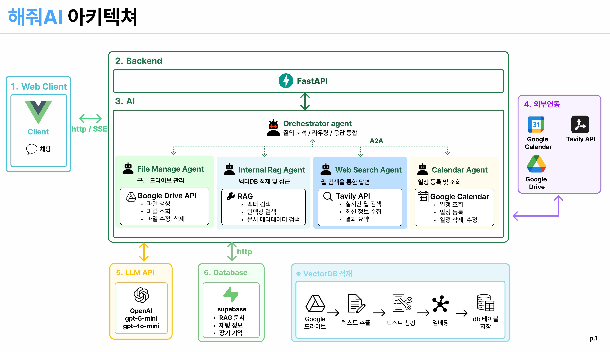

# A2A 프로토콜 실전형 멀티 에이전트 시스템

## 아키텍처
## 아키텍처

```
┌─────────────────────────────────────────────────────────────────────────┐
│                         사용자 (CLI / test_client.py)                    │
└─────────────────────────────────────┬───────────────────────────────────┘
                                      │ A2A Request
                                      ▼
┌─────────────────────────────────────────────────────────────────────────┐
│                    Orchestrator Agent (Port: 10010)                      │
│  ┌────────────────────────────────────────────────────────────────────┐ │
│  │  agent.py (Host Agent)                                              │ │
│  │  • Intent 분석 (LLM)                                                │ │
│  │  • Plan 생성                                                        │ │
│  │  • A2A Client로 Remote Agent 호출 ◄── 공식 패턴                      │ │
│  │  • 결과 통합                                                        │ │
│  └────────────────────────────────────────────────────────────────────┘ │
└─────────────────────────────────────┬───────────────────────────────────┘
                                      │ A2A Protocol
                    ┌─────────────────┼─────────────────┐
                    │                 │                 │
                    ▼                 ▼                 ▼
┌───────────────────────┐ ┌───────────────────┐ ┌───────────────────────┐
│  Web Research Agent   │ │ Internal RAG Agent│ │ File Management Agent │
│    (Port: 10011)      │ │   (Port: 10012)   │ │     (Port: 10013)     │
│                       │ │                   │ │                       │
│ • MCP Tavily 서버     │ │ • LangGraph 기반  │ │ • MCP GDrive 서버     │
│ • create_agent 활용   │ │ • Supabase pgvector│ │ • 파일 업/다운로드     │
│ • 웹/뉴스 검색        │ │ • 검색 + 인덱싱    │ │ • storage_ref 관리    │
└───────────────────────┘ └───────────────────┘ └───────────────────────┘
                                      │
                                      ▼
                        ┌─────────────────────────┐
                        │     Infrastructure      │
                        │  • Google Drive (MCP)   │
                        │  • Supabase pgvector    │
                        │  • Tavily Search (MCP)  │
                        └─────────────────────────┘
```

## 환경 설정

### 1. 패키지 설치

```bash
pip install -r requirements.txt
```

### 2. 환경 변수 설정 (.env)

```
copy .env.example .env
```

```env
OPENAI_API_KEY=your_openai_key
TAVILY_API_KEY=your_tavily_key
SUPABASE_URL=your_supabase_url
SUPABASE_KEY=your_supabase_key
# credentials.json 파일 필요 (Google Cloud Console에서 발급)
```

## 실행 방법

### 1단계: Web Research Agent 서버 실행

```bash
cd web_research_agent
python agent_server.py
```

서버가 `http://localhost:10011`에서 실행됩니다.

### 2단계: Internal RAG Agent 서버 실행

새로운 터미널에서:

```bash
cd internal_rag_agent
python agent_server.py
```

서버가 `http://localhost:10012`에서 실행됩니다.

### 3단계: File Management Agent 서버 실행

새로운 터미널에서:

```bash
cd file_management_agent
python agent_server.py
```

서버가 `http://localhost:10013`에서 실행됩니다.

### 4단계: Calendar Agent 서버 실행

새로운 터미널에서:

```bash
cd calendar_agent
python agent_server.py
```

서버가 `http://localhost:10014`에서 실행됩니다.

### 5단계: Orchestrator Agent 서버 실행

새로운 터미널에서:

```bash
cd orchestrator_agent
python agent_server.py
```

서버가 `http://localhost:10010`에서 실행됩니다.

### 6단계: 클라이언트로 에이전트와 통신

새로운 터미널에서:

```bash
python test_client.py
```

## 파일 구조

```
CHAP11_final-project/
├── README.md
├── requirements.txt
├── test_client.py                  # A2A 오케스트레이터 통합 테스트 클라이언트
├── common/                         # 공통 유틸/공유 모듈
├── orchestrator_agent/             # Host Agent (포트: 10010)
│   ├── agent.py                    # 사용자 요청 분석, Plan 생성, Remote Agent 호출, 결과 통합
│   ├── agent_executor.py           # A2A 요청 실행자
│   └── agent_server.py             # Orchestrator Agent 서버 실행
├── web_research_agent/             # Remote Agent - 웹 검색/최신 정보 조사 (포트: 10011)
│   ├── agent.py
│   ├── agent_executor.py
│   └── agent_server.py
├── internal_rag_agent/             # Remote Agent - 내부 문서 검색/RAG/문서 인덱싱 (포트: 10012)
│   ├── agent.py
│   ├── agent_executor.py
│   ├── agent_server.py
│   └── index.sql                   # Supabase pgvector 테이블/RPC 생성 SQL
├── file_management_agent/          # Remote Agent - Google Drive 파일 관리 (포트: 10013)
│   ├── agent.py
│   ├── agent_executor.py
│   ├── agent_server.py
│   └── gdrive_client.py
└── calendar_agent/                 # Remote Agent - Google Calendar 일정 조회/등록 (포트: 10014)
    ├── agent.py                    # list_events, create_event 처리
    ├── agent_executor.py           # A2A 요청 실행자
    ├── agent_server.py             # Calendar Agent 서버 실행
    └── token.json                  # Google Calendar OAuth 토큰 (.gitignore 처리)
```

### calendar agent 테스트 예시(조회, 등록, 검색, 수정, 삭제, 빈시간 확인, 일정 충돌 방지)
1. 2026-06-27 17:00부터 18:00까지 'AI 에이전트 시연 준비 회의' 일정 등록해줘
2. 2026-06-27 AI 에이전트 시연 준비 회의 일정 찾아줘
3. 2026-06-27 AI 에이전트 시연 준비 회의를 18:00부터 19:00까지로 변경해줘
4. 이번주 일정 요약해줘
5. 2026-06-27 오후에 비어있는 시간 알려줘
6. 2026-06-27 AI 에이전트 시연 준비 회의 일정 삭제해줘